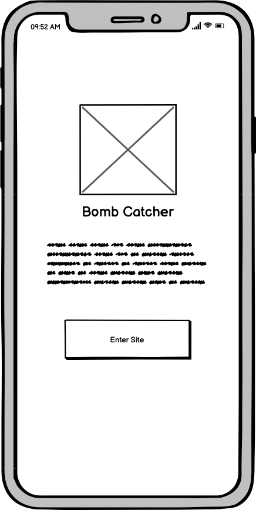
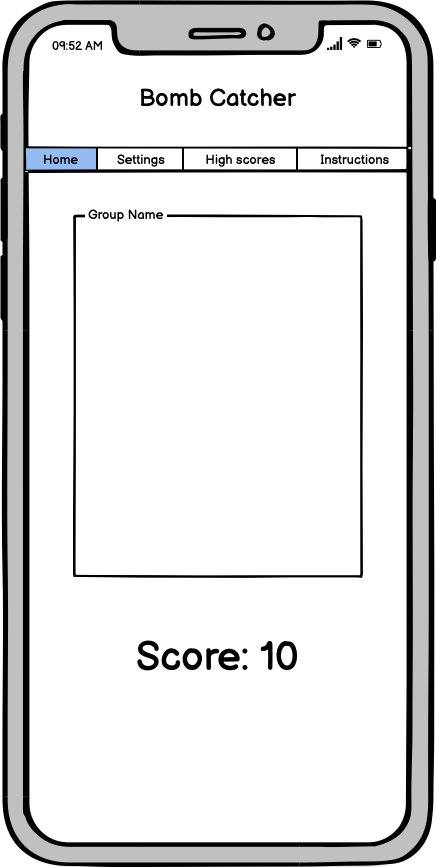
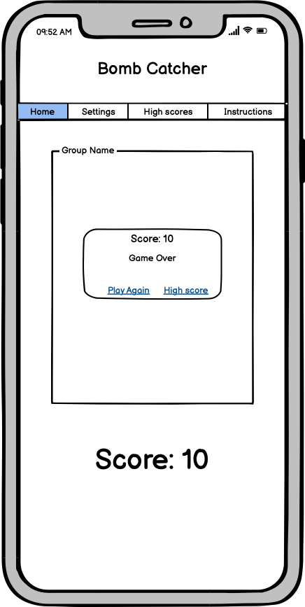
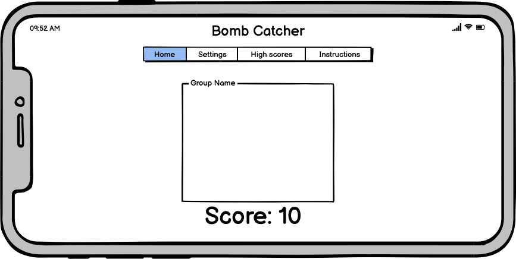
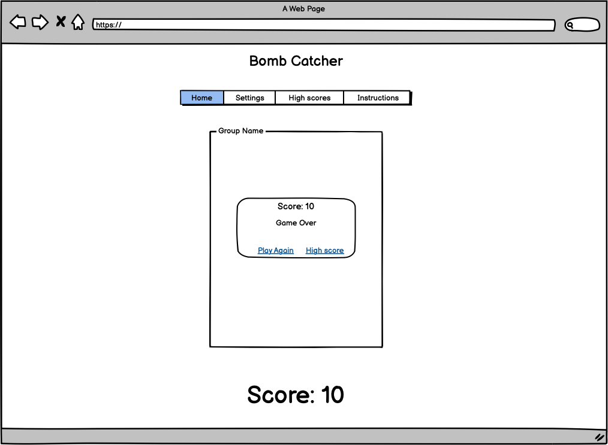
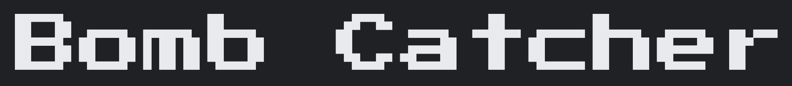
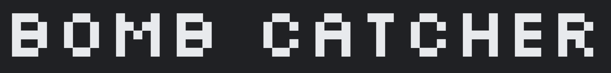

# Bomb Catcher
Bomb Catcher is an addictive game to test your reactions. The game is simple. Defuse the bombs before the explode. When the game starts use your fingers to tap or click  the lit bombs. How many bombs will you be able to defuse, will you set the new high score. For a challenge increase the game difficulty and create your own custom session by changing the grid size, increasing the number of bombs or shorten the fuse time.  

 The live link can be found here - [Bomb Catcher](https://dlhamilton.github.io/Bomb-Catcher/)

*** 

## Contents
* [Analyse and UX](#Analyse-and-UX)
    * [Project Goals](#Project-Goals)
    * [User Stories](#User-Stories)
* [Design](#Design)
    * [Wireframes](#Wireframes)
    * [Colour Scheme](#Colour-Scheme)
    * [Fonts](#Fonts)
* [Features and Implemenation](#Features-and-Implemenation)
    * [Features](#Features)
    * [Function List](#Function-List)
    * [Future Features](#Future-Features)
* [Testing](#Testing)
    * [Validator Testing](#Validator-Testing)
    * [User Stories Testing](#User-Stories-Testing)
    * [Accessibility Testing](#Accessibility-Testing)
    * [Manual Testing](#Manual-Testing)
    * [Fixed Bugs](#Fixed-Bugs)
* [Deployment](#Deployment)
    * [Cloning & Forking](#Cloning-&-Forking)
    * [Local Deployment](#Local-Deployment)
    * [Remote Deployment](#Remote-Deployment)
* [Credits](#Credits)
* [Useful Links](#Useful-Links)

***

## Analyse and UX
### Project Goals
* The Goal of the project is to make an addictive and fun game that will challenge the user.

* It has been designed for people who want to keep coming back to improve their score and compete to get the highest score. 

### User Stories
#### First Time User
|Story No.|Story|
| ------------- | ------------- |
|1|As a first time user ,   I want to be able to know how to start the game   so that I can enjoy the game    I know I am done when their are clear instructions shown to the user |
|2|As a first time user,   I want to be able to add sound when playing the game   so that I can get more indicators that a bomb has been defused or exploded   I know I am done when sounds plays when the user defuses a bomb and a sound plays wen a bomb explodes |
|3|As a first time user,   I want to be able to change the colours   so that I can choose my lighting preference    I know I am done when I can invert the game colours. |

#### Returning Users
|Story No.|Story|
| ------------- | ------------- |
|1|As a returning user,   I want to be able to see high scores   so that I can see what scores I need to beat   I know I am done when the high scores are shown on the game |
|2|As a returning user ,   I want to be able to set a high score  so that I can set a new challenge of other players  I know I am done when the user can enter their score to the high score list |
|3|As a returning user ,   I want to be able to edit the orginal game  so that I can  add a new level of challenge and keep coming back to play  I know I am done when the game allows the speed and grid size to change |

#### All Users
|Story No.|Story|
| ------------- | ------------- |
|1|As a user ,   I want to be able to pause the game  so that I can come back and continue my game if I am enterupted   I know I am done when the user can stop and return to their game |
|2|As a user ,   I want to be able to stop the game  so that I can end a game early if I need to stop   I know I am done when the game over message is shown |
|3|As a user ,   I want to be able to know when I have set a new high score  so that I can know if I need to continue playing  I know I am done when a indicator shows the user they have set a high score |
|4|As a user ,   I want to be able to see what bombs need to be defused  so that I can play the game   I know I am done when the game has a clear indicator of when a bomb has started |
|5|As a user ,   I want to be able to defuse bombs  so that I can play the game   I know I am done when the bomb goes back to an idle state after being clicked/tapped |

***

## Design
### Wireframes
Below are the designs that I can use to build the site. I have used the user story numbers to link where I can meet the goal in my design. This will help me to think about the users needs as I build the page.

#### Index Page Design

#### Game Page Design
 - The game page on mobile devices

 - The game layout modal screen on mobile devices

 - The game layout modal screen on landscape mobile devices

 - The game layout screen on desktop devices

### Colour Scheme
* Colour pallete was custom made on [Coolors](https://coolors.co/)

### Fonts
* Google fonts were used to produce the site:
 - Press Start P2

 - Silkscreen

 - Lexend Deca

***

## Features and Implemenation - X
### Features

### Function List
|Function Name|Input|Return|Purpose|
| ------------- | ------------- | ------------- | ---------- |

### Future Features

***

## Testing
### Validator Testing
#### HTML
* Index: No errors were returned when passing through the official W3C validator
 - https://validator.w3.org/nu/?doc=https%3A%2F%2Fdlhamilton.github.io%2FBomb-Catcher%2F

* Game: No errors were returned when passing through the official W3C validator
 - https://validator.w3.org/nu/?doc=https%3A%2F%2Fdlhamilton.github.io%2FBomb-Catcher%2Fgame.html

#### CSS
* No errors were found when passing through the official Jigsaw validator
 - https://jigsaw.w3.org/css-validator/validator?uri=https%3A%2F%2Fdlhamilton.github.io%2FBomb-Catcher%2Fassets%2Fcss%2Fstyle.css&profile=css3svg&usermedium=all&warning=1&vextwarning=&lang=en
#### JS
* No errors were found when passing through the official Jshint validator
    * The following metrics were returned:
    * There are 61 functions in this file.
    * Function with the largest signature takes 2 arguments, while the median is 0.
    * Largest function has 31 statements in it, while the median is 5.
    * The most complex function has a cyclomatic complexity value of 20 while the median is 2.

### User Stories Testing - X

#### First Time User
|Story No.|Result|Story/ Evidence|
| ------------- | ------------- | ------------- |
|1| |As a first time user ,   I want to be able to know how to start the game   so that I can enjoy the game    I know I am done when their are clear instructions shown to the user |
|2| |As a first time user,   I want to be able to add sound when playing the game   so that I can get more indicators that a bomb has been defused or exploded   I know I am done when sounds plays when the user defuses a bomb and a sound plays wen a bomb explodes |
|3| |As a first time user,   I want to be able to change the colours   so that I can choose my lighting preference    I know I am done when I can invert the game colours. |

#### Returning Users
|Story No.|Result|Story/ Evidence|
| ------------- | ------------- | ------------- |
|1| |As a returning user,   I want to be able to see high scores   so that I can see what scores I need to beat   I know I am done when the high scores are shown on the game |
|2| |As a returning user ,   I want to be able to set a high score  so that I can set a new challenge of other players  I know I am done when the user can enter their score to the high score list |
|3| |As a returning user ,   I want to be able to edit the orginal game  so that I can  add a new level of challenge and keep coming back to play  I know I am done when the game allows the speed and grid size to change |

#### All Users
|Story No.|Result|Story/ Evidence|
| ------------- | ------------- | ------------- |
|1| |As a user ,   I want to be able to pause the game  so that I can come back and continue my game if I am enterupted   I know I am done when the user can stop and return to their game |
|2| |As a user ,   I want to be able to stop the game  so that I can end a game early if I need to stop   I know I am done when the game over message is shown |
|3| |As a user ,   I want to be able to know when I have set a new high score  so that I can know if I need to continue playing  I know I am done when a indicator shows the user they have set a high score |
|4| |As a user ,   I want to be able to see what bombs need to be defused  so that I can play the game   I know I am done when the game has a clear indicator of when a bomb has started |
|5| |As a user ,   I want to be able to defuse bombs  so that I can play the game   I know I am done when the bomb goes back to an idle state after being clicked/tapped |

### Accessibility Testing

To check the colors and fonts, I used Lighthouse in the Google devtools. The results are shown below:

| Index  |
| ------- |
|  |

| Game |
| ------- |
|  |

### Manual Testing - X
- I have tested that this page works in different web browsers.
- I have tested that the project is responsive and works with different device sizes. It looks good and functions as normal. 
- I have tested all links, internal and external. They go to the correct destination and open in the correct way. 
- I have tested that all text and fonts are readable and easy to understand.
- I have tested that the correct data is passed when the forms are submitted. 
- I have tested that the sorts for high scores work correctly.
- I have tested that the user can add a high score to local storage.
- I have tested sound plays at the correct time during the game
- I have tested the bombs change colour when ignited
- I have tested that the eplode image appears when a bomb explodes
- I have tested that pressijg or tapping a bomb defuses it

This is a sample of shots of what the site looks like on different devices. 

#### Desktop
|Safari 13.1.1|Firefox 103.0.2|Chrome 104.0.5112.79|
| ----------- | ------------- | ------------------ |
||||
||||
||||
||||

#### Mobile and Tablet
##### Safari iOS 15.5

 
 
 
 

##### Chrome 104 for Android

 
 

##### Safari iOS tablet 12.5.5

### Fixed Bugs - X

#### Sound

#### Rotation 
When on a mobile device the user has the ability to rotate the device. When this happened the bomb grid would appear ofF the screen and would not resize. I used the JQuery commmand to put the bombs into a new ratio aspect that allowed the grid to resize on the screen and use the 'vh' to workout the size of the grid. The function is called when the 'vw' is larger than the 'vh'.

Below is an example of the fixed feature. 

- Portrait game

- Landscape game

***

## Deployment

### Cloning & Forking
#### Fork
1. On GitHub.com, navigate to the [dlhamilton/Bomb-Catcher](https://github.com/dlhamilton/Bomb-Catcher) repository.
2. In the top-right corner of the page, click Fork.
3. By default, forks are named the same as their parent repositories. You can change the name of the fork to distinguish it further.
4. Add a description to your fork.
5. Click Create fork.

#### Clone
1. Above the list of files click the button that says 'Code'.
2. Copy the URL for the repository.
3. Open Terminal. Change the directory to the location where you want the cloned directory.
4. Type git clone, and then paste the URL
5. Press Enter.

### Local Deployment
1. Sign up to [Gitpod](https://gitpod.io/)
2. Download the Gitpod browser extension.
3. On GitHub.com, navigate to the [dlhamilton/Bomb-Catcher](https://github.com/dlhamilton/Bomb-Catcher) repository.
4. Above the list of files click the button that says 'Gitpod'.

### Remote Deployment
 The site was deployed to Github pages. If you have forked/cloned the repository the steps to deploy are:
 1. On GitHub.com, navigate to your repository.
 2. Navigate to the settings tab.
 3. Click on the tab called 'pages' on the left hand side.
 4. From the source drop down list under the heading Build and deployment, select main.
 5. The page will hten provide the link to the website.

 The live link can be found here - [Bomb Catcher](https://dlhamilton.github.io/Bomb-Catcher/)

*** 

## Credits

### Content
- Processes from the CI Love Running project was used to help create this website - [CI Love Running](https://code-institute-org.github.io/love-running-2.0/index.html)

- Processes from the Love Maths project was used to help create this website - [CI Love Maths](https://code-institute-org.github.io/love-maths/)

- HTML, CSS and Javascript code help was taken from w3schools - [W3Schools](https://www.w3schools.com/)

- Responsive web typography to help with bomb ratio - [FlowType.JS](https://simplefocus.com/flowtype/) by [Simple Focus](https://simplefocus.com/) , [Git](https://github.com/simplefocus/FlowType.JS#readme)

### Media
#### Images
- Bomb image from - [pixabay image](https://pixabay.com/vectors/bomb-explosive-detonation-fuze-154456/)

#### Sounds
- defuse sound and explode sound from - [pixabay sounds](https://pixabay.com/sound-effects/search/fuse/)

#### Icons
- All page Icons - [Font Awesome](https://fontawesome.com/)

***