# Bomb Catcher
Bomb Catcher is an addictive game to test your reactions. The game is simple. Defuse the bombs before the explode. When the game starts use your fingers to tap or click  the lit bombs. How many bombs will you be able to defuse, will you set the new high score. For a challenge increase the game difficulty and create your own custom session by changing the grid size, increasing the number of bombs or shorten the fuse time.  

 The live link can be found here - [Bomb Catcher](https://dlhamilton.github.io/Bomb-Catcher/)

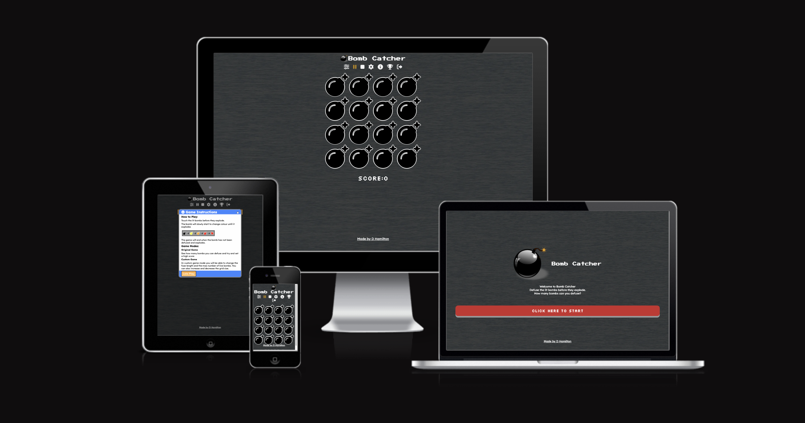

*** 

## Contents
* [Project Goals and UX](#Analyse-and-UX)
    * [Project Goals](#Project-Goals)
    * [User Stories](#User-Stories)
* [Design](#Design)
    * [Wireframes](#Wireframes)
    * [Colour Scheme](#Colour-Scheme)
    * [Fonts](#Fonts)
* [Features and Implemenation](#Features-and-Implemenation)
    * [Features](#Features)
    * [Function List](#Function-List)
    * [Future Features](#Future-Features)
* [Testing](#Testing)
    * [Validator Testing](#Validator-Testing)
    * [User Stories Testing](#User-Stories-Testing)
    * [Accessibility Testing](#Accessibility-Testing)
    * [Manual Testing](#Manual-Testing)
    * [Fixed Bugs](#Fixed-Bugs)
* [Deployment](#Deployment)
    * [Cloning & Forking](#Cloning-&-Forking)
    * [Local Deployment](#Local-Deployment)
    * [Remote Deployment](#Remote-Deployment)
* [Credits](#Credits)
* [Useful Links](#Useful-Links)

***

## Project Goals and UX

### Project Goals
* The Goal of the project is to make an addictive and fun game that will challenge the user.

* It has been designed for people who want to keep coming back to improve their score and compete to get the highest score. 

### User Stories
#### First Time User
|Story No.|Story|
| ------------- | ------------- |
|1|As a first time user ,   I want to be able to know how to start the game   so that I can enjoy the game    I know I am done when their are clear instructions shown to the user |
|2|As a first time user,   I want to be able to add sound when playing the game   so that I can get more indicators that a bomb has been defused or exploded   I know I am done when sounds plays when the user defuses a bomb and a sound plays wen a bomb explodes |
|3|As a first time user,   I want to be able to change the colours   so that I can choose my lighting preference    I know I am done when I can invert the game colours. |

#### Returning Users
|Story No.|Story|
| ------------- | ------------- |
|1|As a returning user,   I want to be able to see high scores   so that I can see what scores I need to beat   I know I am done when the high scores are shown on the game |
|2|As a returning user ,   I want to be able to set a high score  so that I can set a new challenge of other players  I know I am done when the user can enter their score to the high score list |
|3|As a returning user ,   I want to be able to edit the orginal game  so that I can  add a new level of challenge and keep coming back to play  I know I am done when the game allows the speed and grid size to change |

#### All Users
|Story No.|Story|
| ------------- | ------------- |
|1|As a user ,   I want to be able to pause the game  so that I can come back and continue my game if I am enterupted   I know I am done when the user can stop and return to their game |
|2|As a user ,   I want to be able to stop the game  so that I can end a game early if I need to stop   I know I am done when the game over message is shown |
|3|As a user ,   I want to be able to know when I have set a new high score  so that I can know if I need to continue playing  I know I am done when a indicator shows the user they have set a high score |
|4|As a user ,   I want to be able to see what bombs need to be defused  so that I can play the game   I know I am done when the game has a clear indicator of when a bomb has started |
|5|As a user ,   I want to be able to defuse bombs  so that I can play the game   I know I am done when the bomb goes back to an idle state after being clicked/tapped |

***

## Design

### Wireframes
Below are the designs that I can use to build the site. I have used the user story numbers to link where I can meet the goal in my design. This will help me to think about the users needs as I build the page.

#### Index Page Design

Click to see design

 

#### Game Page Design

The game page on mobile devices
 

Click to see design

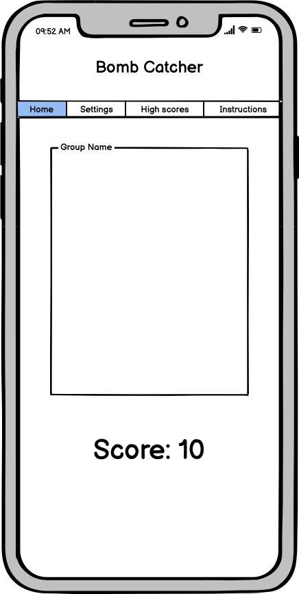

 

 The game layout modal screen on mobile devices
 

Click to see design

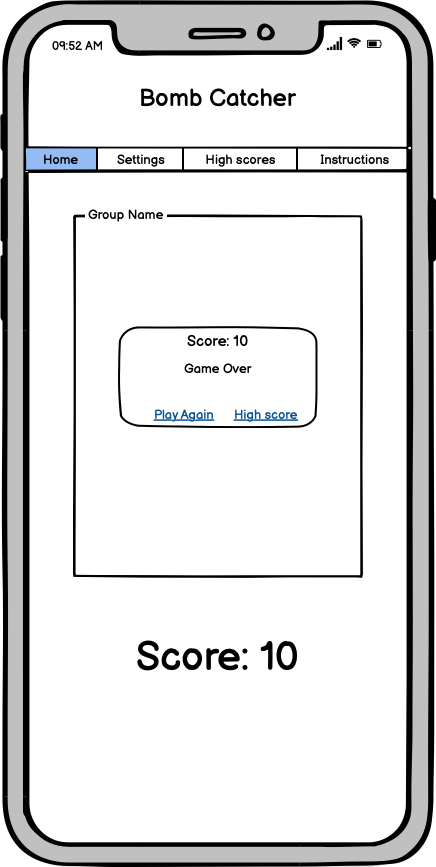

 

The game layout modal screen on landscape mobile devices
 

Click to see design

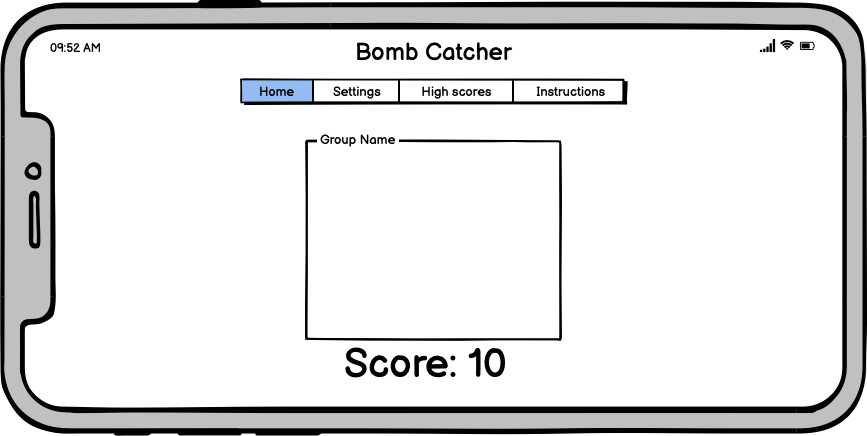

 

 The game layout screen on desktop devices
 

Click to see design

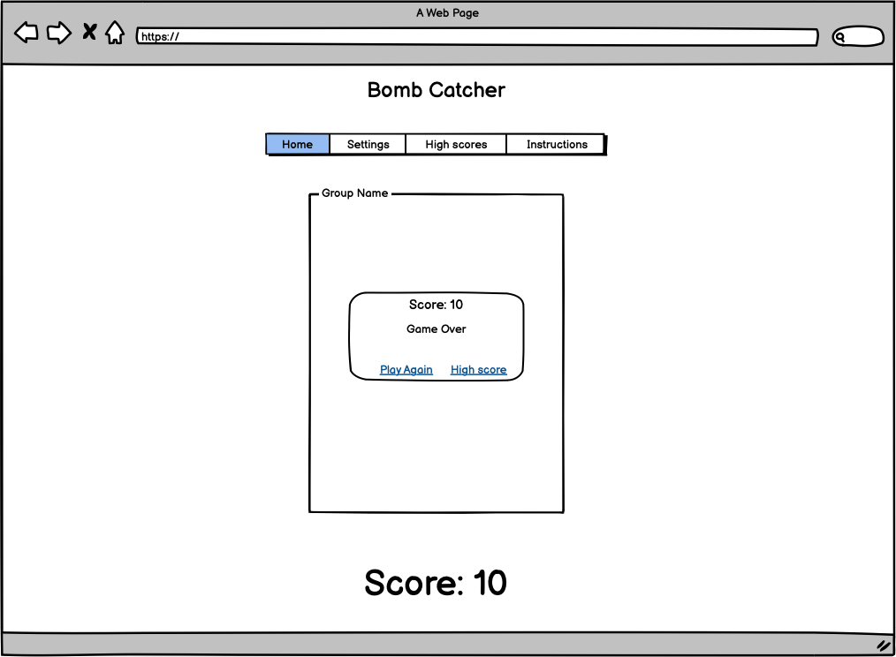

 

### Colour Scheme
* Colour pallete was custom made on [Coolors](https://coolors.co/)
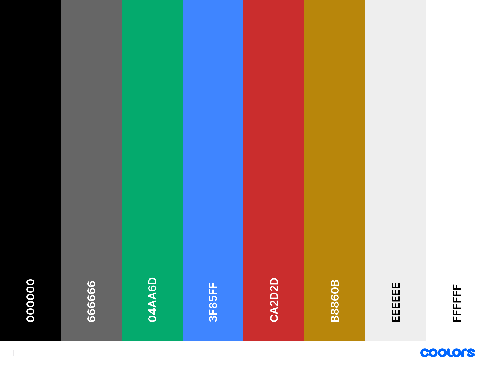
### Fonts
* Google fonts were used to produce the site:
 - Press Start P2 
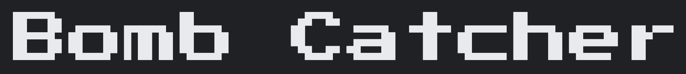
 - Silkscreen 
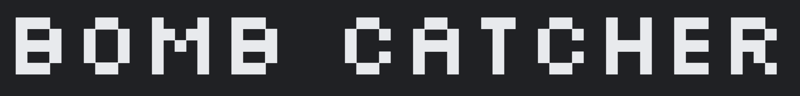
 - Lexend Deca 

***

## Features and Implemenation

### Features
#### Index Page
**Welcome Button** 
Button to enter game, click the button to go to the game page. 
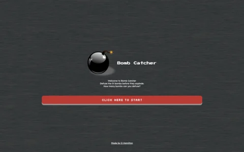

**Creator Link** 
link to my Github so you can contact the developer. 
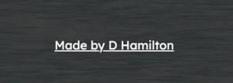

**Index Signpost** 
Details about the game to give the user clear signposts. 
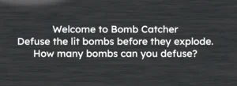

#### Game Page
**Game Instructions Modal** 
Game Instruction modal will show when the user first visits the site. The modal explains how to play the game. 
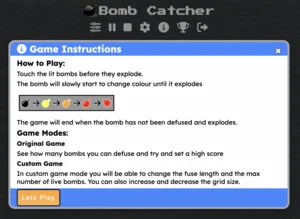

**Game Settings Modal** 
Orginal Game - has the standard settings of a 4 x 4 grid with 3 active bombs at a time with a fuse length of 3 seconds. The countdown to start the game will be 3 seconds and game level will be 5. 
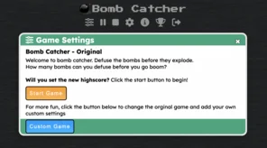

Custom game - has a form where the user can set their own game settings. When the uses confirms the game is created with the chossen settings.  

**Navigation and Controls** 
* Stop game - Stop the game and brings up the game over modal.
* Pause - Pauses the game and then allows the user to continue.
* Game settings - Opens the game settings modal and also pauses the game if it is currently playing. 
* Settings - Opens the modal which contians the volume, sound and ligh mode settings. You can also reset the high scores. 
* Instructions - Shows the game instuctions modal.
* High scores - Shows the high scores modal.
* Home - returns the user back to the index page. 
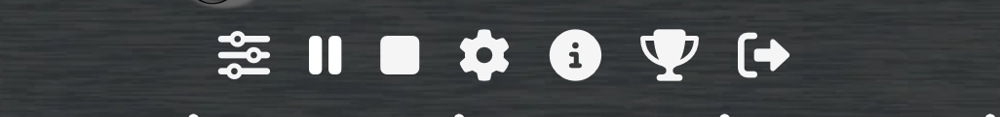

**Game Elements** 
* Game grid - The grid is made when the user starts a game. The scale of the bombs is dependent on how many bombs are in the grid. The max size of the grid is 500px
* Bombs - Will change colour when they start to fuse. The colour scale is shown below. When a user taps or clicks the bombs it will defuse and go back to idle. 
* Exploded bomb -  if the user misses a bomb then the icon will change to an explosion symbol. 
* Score indicator - This shows the users score. The colour of the text will change to gold if the user gets a new high score.  
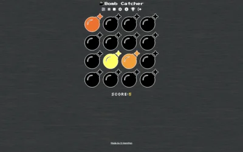

**Settings Modal** 
* Game sounds - The user has an option of turning on game sounds which will enable a pop sound when the user defuses a bomb and an explosion sound when a bomb explodes. The volume will be hidden until the user turns the sound switch on. 
* Light mode - will change the background, icons and bomb colours to suit the users preference. 
* Reset high score - This will reset the the local storage and remove the high score stored. 
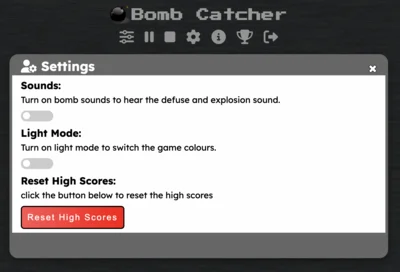
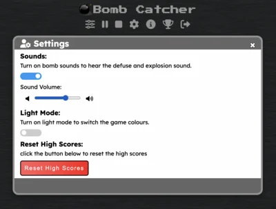

**High Scores Modal** 
* Enter New high score - Users can enter their name when they set a new high score and it will add it to lcoal storage, It will format the names with a captial letter for the first character.
* High scores - shows the high scores that are stored in local storage. 
* Sort high scores - This will sort the high scores in score order, bombs defused per second or the date usimng a bubble sort. 
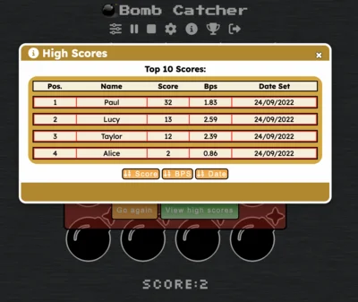
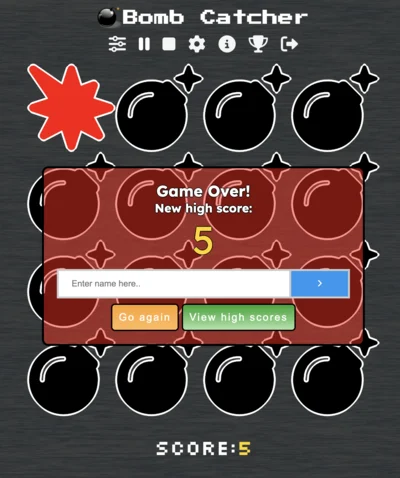

**Screen size** 
The bomb grid will be the device width and go to a max size of 500px. 

**Orientation** 
If the width of the device is larger than the height the bomb grid will change the size to max width of the view height so bombs stay on the screen. 

**Light Mode** 
The game screen changes colour to this in light mode. 

### Future Features 

* A future feature is to add a game mode where the game speed will increase, bomb fuse will decrease and number of active bombs will increase as the user progresses in the game. Thus will increse the challenge and hopfully get users to keep playing.

* A future feature is to add a timed game where users will need to defuse as many bombs as possible in a given time frame. This will make the game more competitive as players can challenge each other to see who has the faster hand speed. 

***

## Testing
### Validator Testing
#### HTML
* Index: No errors were returned when passing through the official W3C validator
 - https://validator.w3.org/nu/?doc=https%3A%2F%2Fdlhamilton.github.io%2FBomb-Catcher%2F

* Game: No errors were returned when passing through the official W3C validator
 - https://validator.w3.org/nu/?doc=https%3A%2F%2Fdlhamilton.github.io%2FBomb-Catcher%2Fgame.html

#### CSS
* No errors were found when passing through the official Jigsaw validator
 - https://jigsaw.w3.org/css-validator/validator?uri=https%3A%2F%2Fdlhamilton.github.io%2FBomb-Catcher%2Fassets%2Fcss%2Fstyle.css&profile=css3svg&usermedium=all&warning=1&vextwarning=&lang=en

#### JS
* No errors were found when passing through the official Jshint validator
    * The following metrics were returned:
    * There are 61 functions in this file.
    * Function with the largest signature takes 2 arguments, while the median is 0.
    * Largest function has 31 statements in it, while the median is 5.
    * The most complex function has a cyclomatic complexity value of 20 while the median is 2.

### User Stories Testing

#### First Time User
|Story No.|Result|Story/ Evidence|
| ------------- | ------------- | ------------- |
|1|Test Pass|As a first time user ,   I want to be able to know how to start the game   so that I can enjoy the game    I know I am done when their are clear instructions shown to the user   Evidence: The index page has clear signpost how to start the game and when a user first opens the game page the instruction modal appears telling the user how to play the game.  |
|2|Test Pass |As a first time user,   I want to be able to add sound when playing the game   so that I can get more indicators that a bomb has been defused or exploded   I know I am done when sounds plays when the user defuses a bomb and a sound plays wen a bomb explodes   Evidence: In the settings modal, users are able to turn the sound on and control the volume level.  |
|3|Test Pass |As a first time user,   I want to be able to change the colours   so that I can choose my lighting preference    I know I am done when I can invert the game colours.   Evidence: In the settings modal, users are able to turn the light mode on and off.  |

#### Returning Users
|Story No.|Result|Story/ Evidence|
| ------------- | ------------- | ------------- |
|1|Test Pass |As a returning user,   I want to be able to see high scores   so that I can see what scores I need to beat   I know I am done when the high scores are shown on the game   Evidence: The user can open the high score modal and it loads the scores from local storage.  |
|2|Test Pass |As a returning user ,   I want to be able to set a high score  so that I can set a new challenge of other players  I know I am done when the user can enter their score to the high score list   Evidence: When a game is over it will check to see if the users score is in the top ten and give the user the ability to enter a name and add the score to local storage.  |
|3|Test Pass |As a returning user ,   I want to be able to edit the orginal game  so that I can  add a new level of challenge and keep coming back to play  I know I am done when the game allows the speed and grid size to change   Evidence: The game settings modal allows the user to change the basic game settings.  |

#### All Users
|Story No.|Result|Story/ Evidence|
| ------------- | ------------- | ------------- |
|1|Test Pass |As a user ,   I want to be able to pause the game  so that I can come back and continue my game if I am enterupted   I know I am done when the user can stop and return to their game   Evidence: The pause icon will pause the game state, pressing pause again will continue the game.  |
|2|Test Pass |As a user ,   I want to be able to stop the game  so that I can end a game early if I need to stop   I know I am done when the game over message is shown   Evidence: The stop button will end the current game and show the score.  |
|3| Test Pass|As a user ,   I want to be able to know when I have set a new high score  so that I can know if I need to continue playing  I know I am done when a indicator shows the user they have set a high score   Evidence: The score area will turn gold when the user has a new top score.  |
|4|Test Pass |As a user ,   I want to be able to see what bombs need to be defused  so that I can play the game   I know I am done when the game has a clear indicator of when a bomb has started   Evidence: A bomb will start to change colour when it has been lit.  |
|5|Test Pass |As a user ,   I want to be able to defuse bombs  so that I can play the game   I know I am done when the bomb goes back to an idle state after being clicked/tapped   Evidence: A bomb will stop exploding and go back to being idle when clicked/tapped.  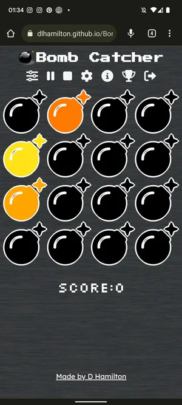|

### Accessibility Testing

To check the colors and fonts, I used Lighthouse in the Google devtools. The results are shown below:

| Index  |
| ------- |
| 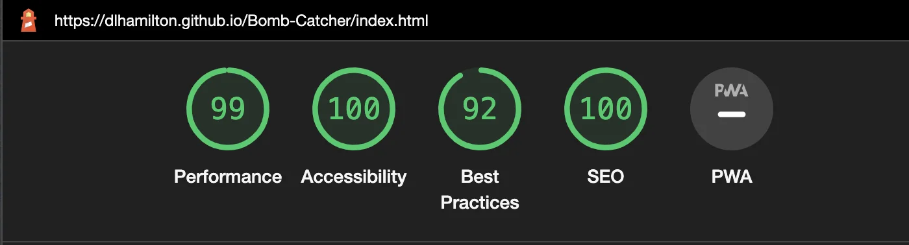 |

| Game |
| ------- |
| 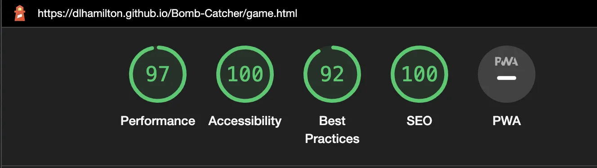 |

### Manual Testing
- I have tested that this page works in different web browsers.
- I have tested that the project is responsive and works with different device sizes. It looks good and functions as normal. 
- I have tested all links, internal and external. They go to the correct destination and open in the correct way. 
- I have tested that all text and fonts are readable and easy to understand.
- I have tested that the correct data is passed when the forms are submitted. 
- I have tested that the sorts for high scores work correctly, using a bubble sort.
- I have tested that the user can add a high score to local storage.
- I have tested that sound plays at the correct time during the game. When defused and exploded.
- I have tested the bombs change colour when ignited
- I have tested that the explode image appears when a bomb explodes
- I have tested that pressing or tapping a bomb defuses it
- I have tested that the user can change the game colours to light mode.

This is a sample of shots of what the site looks like on different devices. 

#### Desktop
|Safari 15.6|Firefox 103.0.2|Chrome 106.0.5249.61|
| ----------- | ------------- | ------------------ |
|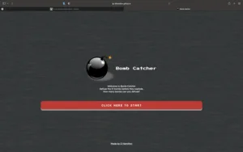|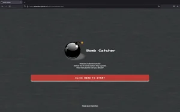|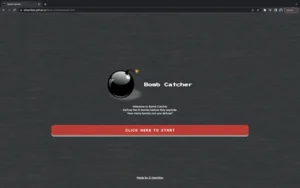|
|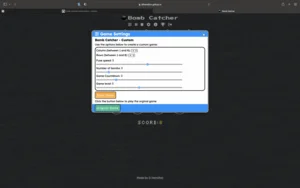|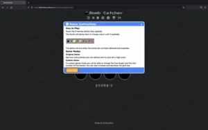|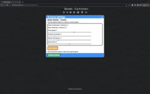|
|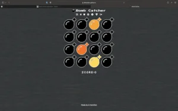|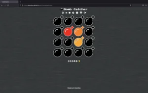|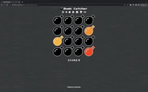|
|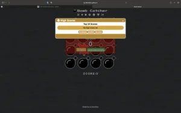|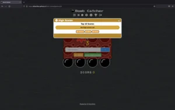|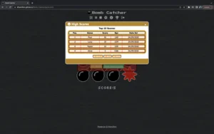|

#### Mobile and Tablet
##### Safari iOS 16.0

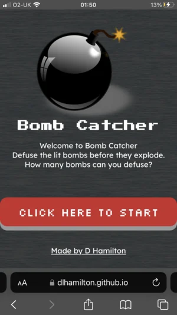
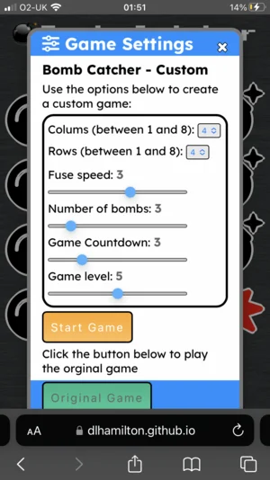
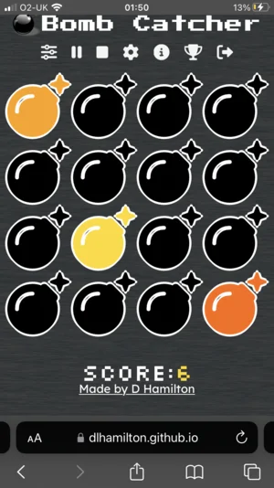
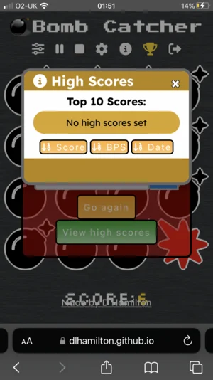

##### Chrome 105 for Android

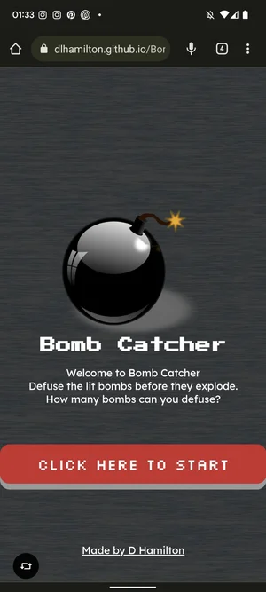
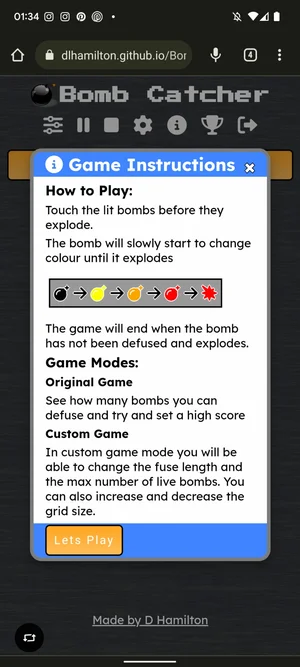

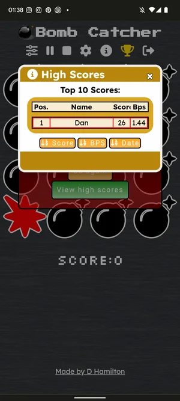

### Fixed Bugs
#### Sound
In the game we have two game sounds. Defuse a bomb pop and explosion. Both sounds have a trigger for when they should play. The Bomb defuse pop should play when the user clicks/ taps the lit bomb and defuses it. The explosion sound should play when a user is unable to defuse a bomb in time and the game ends. The bug we had was during testing. The sound was not playing at the correct time when running on ios safari. Trying to play multiple sounds would mean that the sounds were getting added onto a queue and instead of playing at the right time it would play as soon as it was at the front of the queue. 

There were 2 factors hat enabled the sound to work with ios. The first was the refactoring of the sound to create the audio element when the sound switch was set to true. This enablled the audio to play. This means that the audio element does not need a new trigger to play because the auido element already exists. I enabled the bomb pop to play at the correct time by controlling the src of the audio which made the sound play again from the beginning straight away. It also means the autoplay issue did not effect the bomb explode sound because it did not need to create a new audio element, just play the current one with a new src. 

The other factor that allowed the ios safari audio to play was the new update to ios 16 which enablled sound to work like other browsers. This means that older models will not be able to have the sound working effectivy but newer/updated devices will work. 

#### Rotation 
When on a mobile device the user has the ability to rotate the device. When this happened the bomb grid would appear ofF the screen and would not resize. I used the JQuery commmand to put the bombs into a new ratio aspect that allowed the grid to resize on the screen and use the 'vh' to workout the size of the grid. The function is called when the 'vw' is larger than the 'vh'.

Below is an example of the fixed feature. 

- Portrait game 

- Landscape game 

***

## Deployment

### Cloning & Forking
#### Fork
1. On GitHub.com, navigate to the [dlhamilton/Bomb-Catcher](https://github.com/dlhamilton/Bomb-Catcher) repository.
2. In the top-right corner of the page, click Fork.
3. By default, forks are named the same as their parent repositories. You can change the name of the fork to distinguish it further.
4. Add a description to your fork.
5. Click Create fork.

#### Clone
1. Above the list of files click the button that says 'Code'.
2. Copy the URL for the repository.
3. Open Terminal. Change the directory to the location where you want the cloned directory.
4. Type git clone, and then paste the URL
5. Press Enter.

### Local Deployment
1. Sign up to [Gitpod](https://gitpod.io/)
2. Download the Gitpod browser extension.
3. On GitHub.com, navigate to the [dlhamilton/Bomb-Catcher](https://github.com/dlhamilton/Bomb-Catcher) repository.
4. Above the list of files click the button that says 'Gitpod'.

### Remote Deployment
 The site was deployed to Github pages. If you have forked/cloned the repository the steps to deploy are:
 1. On GitHub.com, navigate to your repository.
 2. Navigate to the settings tab.
 3. Click on the tab called 'pages' on the left hand side.
 4. From the source drop down list under the heading Build and deployment, select main.
 5. The page will hten provide the link to the website.

 The live link can be found here - [Bomb Catcher](https://dlhamilton.github.io/Bomb-Catcher/)

*** 

## Credits

### Content
- Processes from the CI Love Running project was used to help create this website - [CI Love Running](https://code-institute-org.github.io/love-running-2.0/index.html)

- Processes from the Love Maths project was used to help create this website - [CI Love Maths](https://code-institute-org.github.io/love-maths/)

- HTML, CSS and Javascript code help was taken from w3schools - [W3Schools](https://www.w3schools.com/)

- Responsive web typography to help with bomb ratio - [FlowType.JS](https://simplefocus.com/flowtype/) by [Simple Focus](https://simplefocus.com/) , [Git](https://github.com/simplefocus/FlowType.JS#readme)

- There has been useful guidance from various articles from Stack Overflow - [Stack Overflow ](https://stackoverflow.com/)

### Media
#### Images
- Bomb image from - [pixabay image](https://pixabay.com/vectors/bomb-explosive-detonation-fuze-154456/)

#### Sounds
- defuse sound and explode sound from - [pixabay sounds](https://pixabay.com/sound-effects/search/fuse/)

#### Icons
- All page Icons - [Font Awesome](https://fontawesome.com/)

***